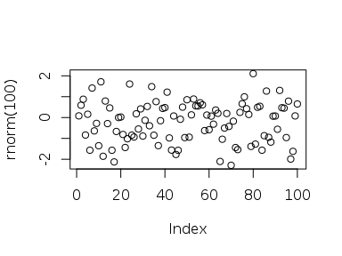
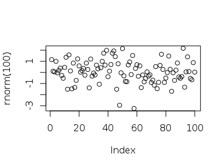
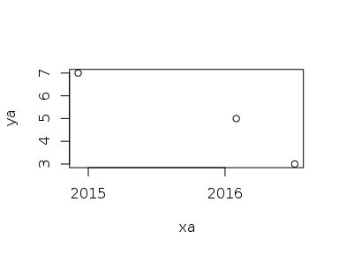

Todo 1
------

``` r
((2014 - 2014)/(2014 - 1995)) * 100
```

    ## [1] 0

Todo 2
------

``` r
start_year = 2014
birth_year = 1995
((start_year - 2014)/(start_year - birth_year))
```

    ## [1] 0

Todo 3
------

``` r
sum(c(4, 5, 8, 11))
```

    ## [1] 28

Todo 4
------

``` r
plot(rnorm(100))
```

<!-- -->

Todo 5
------

``` r
?sqrt
```

Todo 6
------

``` r
source("/Rstudio/firstscript.R")
```

<!-- -->

Todo 7
------

``` r
P = c(31:60)
Q = matrix(
  data = P,
  nrow = 6,
  ncol = 5
)
```

Todo 8
------

``` r
source("/Rstudio/secondscript.R")
```

<!-- -->

Todo 9
------

``` r
source("/Rstudio/secondscript.R")
```

<!-- -->

Todo 10
-------

``` r
d = read.table(file="/Rstudio/tst0.txt", header=TRUE)
e = d * 5
write.table(e, file="/Rstudio/tst1.txt", row.name=FALSE)
```

Todo 11
-------

``` r
mean(sqrt(rnorm(100)))
```

    ## Warning in sqrt(rnorm(100)): NaNs produced

    ## [1] NaN

Todo 12
-------

``` r
xa = as.Date(c("20160131", "20141205", "20160705"), format="%Y%m%d")
ya = c(5, 7, 3)
plot(xa, ya)
```

<!-- -->

Todo 13
-------

``` r
v = c(1:100)
n = c()
for(i in v) {
  if(i < 5 | i > 90) {
    n[i] = i * 10
  } else {
    n[i] = i * 0.1
  }
}
n
```

    ##   [1]   10.0   20.0   30.0   40.0    0.5    0.6    0.7    0.8    0.9    1.0
    ##  [11]    1.1    1.2    1.3    1.4    1.5    1.6    1.7    1.8    1.9    2.0
    ##  [21]    2.1    2.2    2.3    2.4    2.5    2.6    2.7    2.8    2.9    3.0
    ##  [31]    3.1    3.2    3.3    3.4    3.5    3.6    3.7    3.8    3.9    4.0
    ##  [41]    4.1    4.2    4.3    4.4    4.5    4.6    4.7    4.8    4.9    5.0
    ##  [51]    5.1    5.2    5.3    5.4    5.5    5.6    5.7    5.8    5.9    6.0
    ##  [61]    6.1    6.2    6.3    6.4    6.5    6.6    6.7    6.8    6.9    7.0
    ##  [71]    7.1    7.2    7.3    7.4    7.5    7.6    7.7    7.8    7.9    8.0
    ##  [81]    8.1    8.2    8.3    8.4    8.5    8.6    8.7    8.8    8.9    9.0
    ##  [91]  910.0  920.0  930.0  940.0  950.0  960.0  970.0  980.0  990.0 1000.0

Todo 14
-------

``` r
fun1 = function(a.vector) {
  n = c()
  for(i in 0:length(a.vector)) {
    if(i < 5 | i > 90) {
      n[i] = i * 10
    } else {
      n[i] = i * 0.1
    }
  }
  return(n)
}
fun1(c(1:100))
```

    ##   [1]   10.0   20.0   30.0   40.0    0.5    0.6    0.7    0.8    0.9    1.0
    ##  [11]    1.1    1.2    1.3    1.4    1.5    1.6    1.7    1.8    1.9    2.0
    ##  [21]    2.1    2.2    2.3    2.4    2.5    2.6    2.7    2.8    2.9    3.0
    ##  [31]    3.1    3.2    3.3    3.4    3.5    3.6    3.7    3.8    3.9    4.0
    ##  [41]    4.1    4.2    4.3    4.4    4.5    4.6    4.7    4.8    4.9    5.0
    ##  [51]    5.1    5.2    5.3    5.4    5.5    5.6    5.7    5.8    5.9    6.0
    ##  [61]    6.1    6.2    6.3    6.4    6.5    6.6    6.7    6.8    6.9    7.0
    ##  [71]    7.1    7.2    7.3    7.4    7.5    7.6    7.7    7.8    7.9    8.0
    ##  [81]    8.1    8.2    8.3    8.4    8.5    8.6    8.7    8.8    8.9    9.0
    ##  [91]  910.0  920.0  930.0  940.0  950.0  960.0  970.0  980.0  990.0 1000.0

Bonus ( Todo 15 )
-----------------

``` r
v = c(1:100)
ifelse(v < 5 | v > 90, v * 10, v * 0.1)
```

    ##   [1]   10.0   20.0   30.0   40.0    0.5    0.6    0.7    0.8    0.9    1.0
    ##  [11]    1.1    1.2    1.3    1.4    1.5    1.6    1.7    1.8    1.9    2.0
    ##  [21]    2.1    2.2    2.3    2.4    2.5    2.6    2.7    2.8    2.9    3.0
    ##  [31]    3.1    3.2    3.3    3.4    3.5    3.6    3.7    3.8    3.9    4.0
    ##  [41]    4.1    4.2    4.3    4.4    4.5    4.6    4.7    4.8    4.9    5.0
    ##  [51]    5.1    5.2    5.3    5.4    5.5    5.6    5.7    5.8    5.9    6.0
    ##  [61]    6.1    6.2    6.3    6.4    6.5    6.6    6.7    6.8    6.9    7.0
    ##  [71]    7.1    7.2    7.3    7.4    7.5    7.6    7.7    7.8    7.9    8.0
    ##  [81]    8.1    8.2    8.3    8.4    8.5    8.6    8.7    8.8    8.9    9.0
    ##  [91]  910.0  920.0  930.0  940.0  950.0  960.0  970.0  980.0  990.0 1000.0
